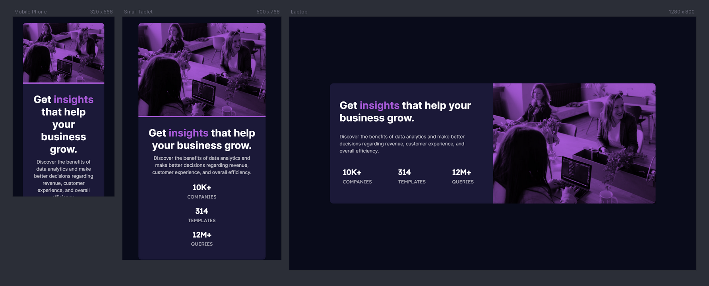

# Frontend Mentor - Stats preview card component solution

This is a solution to the [Stats preview card component challenge on Frontend Mentor](https://www.frontendmentor.io/challenges/stats-preview-card-component-8JqbgoU62). Frontend Mentor challenges help you improve your coding skills by building realistic projects.

## Table of contents

- [Frontend Mentor - Stats preview card component solution](#frontend-mentor---stats-preview-card-component-solution)
  - [Table of contents](#table-of-contents)
  - [Overview](#overview)
    - [The challenge](#the-challenge)
    - [Screenshot](#screenshot)
    - [Links](#links)
  - [My process](#my-process)
    - [Built with](#built-with)
    - [What I learned](#what-i-learned)
    - [Continued development](#continued-development)
  - [Author](#author)
  - [Acknowledgments](#acknowledgments)

## Overview

### The challenge

Users should be able to:

- View the optimal layout depending on their device's screen size

### Screenshot



### Links

- Solution URL: [Frontend Mentors](https://your-solution-url.com)
- Live Site URL: [Live website](https://muralidharabhat.me/stats-preview-card-component-main/)

## My process

### Built with

- Semantic HTML5 markup
- Flexbox
- Mobile-first workflow

### What I learned

Through this challenge, i got to know more about mobile first approach.

```css
.stat p:first-of-type {
	...;
}
```

### Continued development

I have to work more on the responsiveness of the website.

## Author

- Website - [Muralidhara Bhat](https://muralidharabhat.me)
- Frontend Mentor - [@SlenderShield](https://www.frontendmentor.io/profile/SlenderShield)
- Twitter - [@myself_MDB](https://www.twitter.com/myself_MDB)

## Acknowledgments

Thank you [Frontend Mentors](https://fronendmentors.io)
